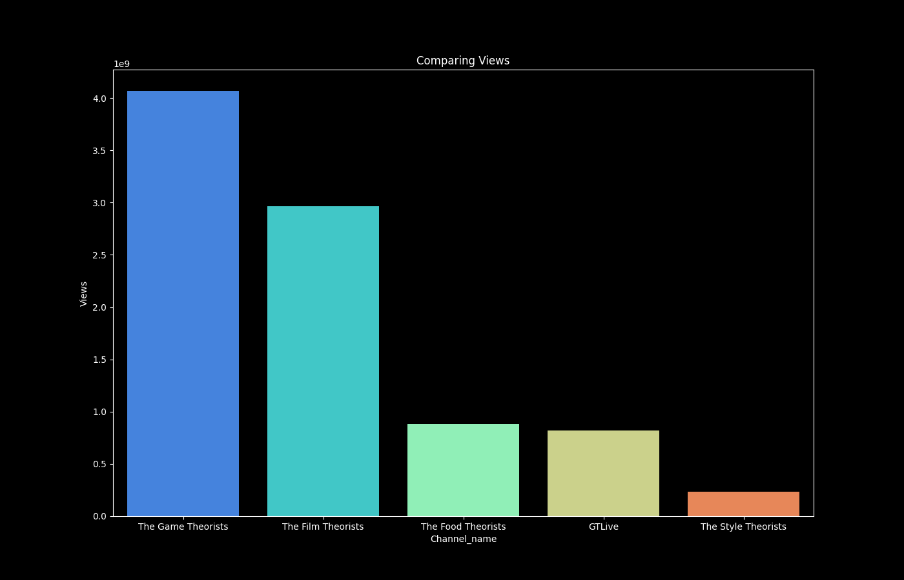
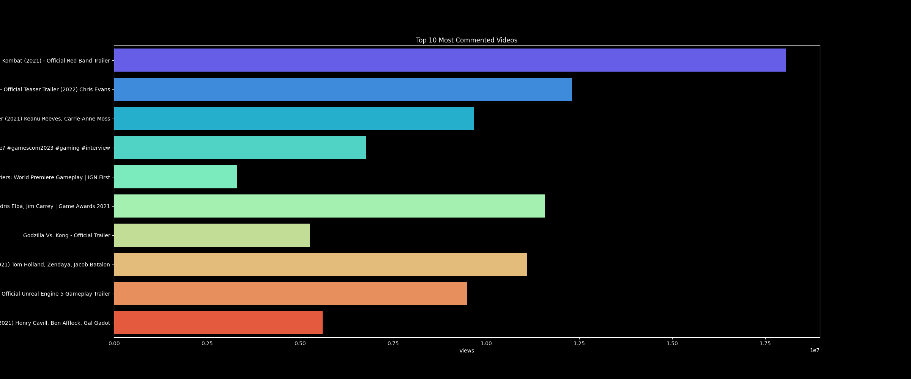

# YouTube Channel Statistics Comparison Tool

This tool is designed for users interested in analyzing and comparing statistics of YouTube channels. 
It utilizes the YouTube Data API to fetch channel statistics such as subscribers, total views, total videos, 
and provides a detailed analysis of videos from a single channel if only one channel ID is entered. 
The tool offers both a visual and quantitative comparison, allowing for an in-depth analysis of YouTube channels and their content.
## Features

- **Multi-Channel Comparison**: Compare statistics of up to 10 YouTube channels.
- **Single-Channel Video Analysis**: Analyze and compare videos from a single YouTube channel if only one channel ID is provided.
- **Utilizes YouTube Data API**: For accurate and up-to-date information.
- **Generates Comparative Bar Charts**: For subscribers, views, total videos, and detailed video analysis including most viewed videos.
- **Data Persistence**: Saves comparative results to a 'results' folder and outputs data to CSV files for both channel and video statistics.

## Examples







## Prerequisites

Before you can use this tool, you need to:

1. Have Python 3 installed on your system.
2. Obtain a Google API key with YouTube Data API v3 enabled. Follow the instructions [here](https://console.developers.google.com/).
3. Find the YouTube channel IDs you wish to compare. You can find these IDs using this [YouTube Channel ID and User ID Converter](https://www.streamweasels.com/tools/youtube-channel-id-and-user-id-convertor/).

## Installation

Clone this repository and install the required Python libraries:

```bash
git clone <repository-url>
cd <repository-directory>

# Install required packages
pip install google-api-python-client pandas matplotlib seaborn
```
## Output

The tool provides two types of output depending on the number of YouTube channel IDs entered:

- **Multi-Channel Comparison**: When more than one channel ID is provided, the tool displays comparative bar charts for the entered YouTube channels. These charts visualize comparisons of subscribers, views, total videos, and views per video. The charts are saved in the `results` folder for easy access. Additionally, a CSV file named `channel_statistics.csv` is created in the root directory, containing the fetched data for all compared channels.

- **Single-Channel Video Analysis**: If only one channel ID is entered, the tool shifts focus to analyzing videos from that single channel. It generates detailed charts for metrics such as video views, likes, and comments, highlighting top-performing videos. Similar to the multi-channel comparison, these charts are saved in the `results` folder, and a CSV file named `videos.csv` is created. This file contains detailed statistics for each video analyzed, offering insights into the channel's content performance.

Both output types are designed to provide a comprehensive understanding of YouTube channel performance, either by comparing multiple channels or by diving deep into the content of a single channel.

## Contributing
Your contributions are welcome! Please feel free to submit pull requests or open issues to suggest improvements or report bugs.

## Acknowledgments
- This project makes use of the YouTube Data API for fetching channel statistics.
- Special thanks to StreamWeasels for providing the tool to easily find YouTube channel IDs.