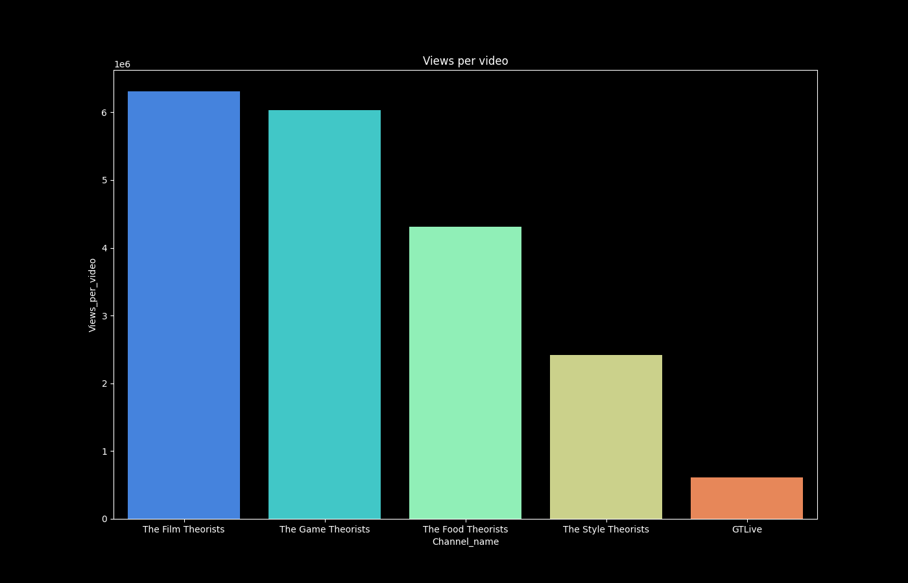
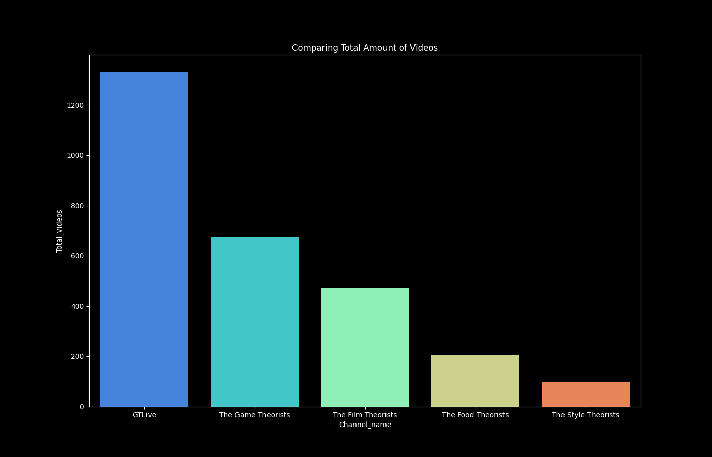
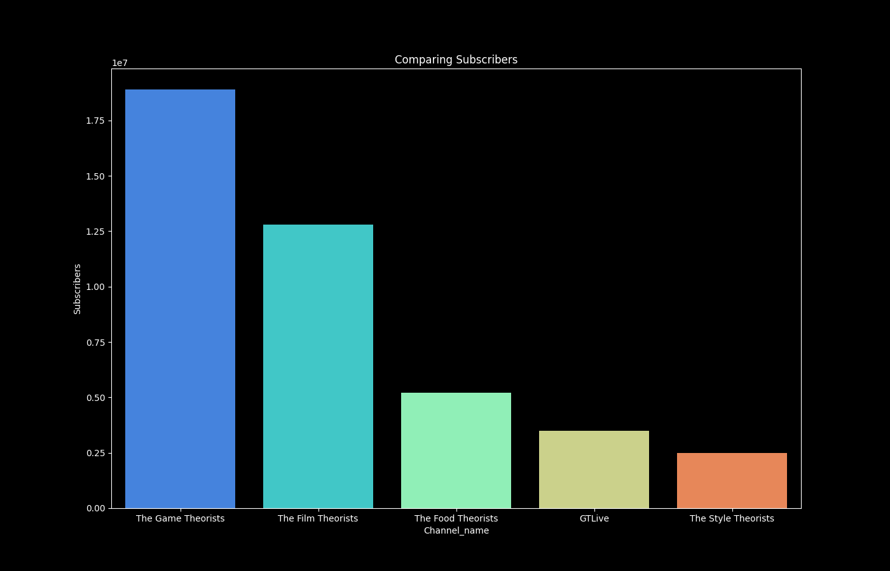

# YouTube Channel Statistics Comparison Tool

This tool is designed for users interested in analyzing and comparing statistics of up to 10 different YouTube channels. It utilizes the YouTube Data API to fetch channel statistics such as subscribers, total views, and total videos. The tool provides a visual and quantitative comparison, allowing for an in-depth analysis of YouTube channels.

## Features

- Compare statistics of up to 10 YouTube channels.
- Utilizes YouTube Data API for accurate and up-to-date information.
- Generates comparative bar charts for subscribers, views, and total videos.
- Saves comparative results to a 'results' folder and outputs data to a CSV file.

## Examples








## Prerequisites

Before you can use this tool, you need to:

1. Have Python 3 installed on your system.
2. Obtain a Google API key with YouTube Data API v3 enabled. Follow the instructions [here](https://console.developers.google.com/).
3. Find the YouTube channel IDs you wish to compare. You can find these IDs using this [YouTube Channel ID and User ID Converter](https://www.streamweasels.com/tools/youtube-channel-id-and-user-id-convertor/).

## Installation

Clone this repository and install the required Python libraries:

```bash
git clone <repository-url>
cd <repository-directory>

# Install required packages
pip install google-api-python-client pandas matplotlib seaborn
```
## Output
The tool will display comparative bar charts for the entered YouTube channels and save these charts in the `results` folder. Additionally, a CSV file named `channel_statistics.csv` containing the fetched data will be created.

## Contributing
Your contributions are welcome! Please feel free to submit pull requests or open issues to suggest improvements or report bugs.

## License
This project is licensed under the MIT License - see the `LICENSE` file for details.

## Acknowledgments
- This project makes use of the YouTube Data API for fetching channel statistics.
- Special thanks to StreamWeasels for providing the tool to easily find YouTube channel IDs.